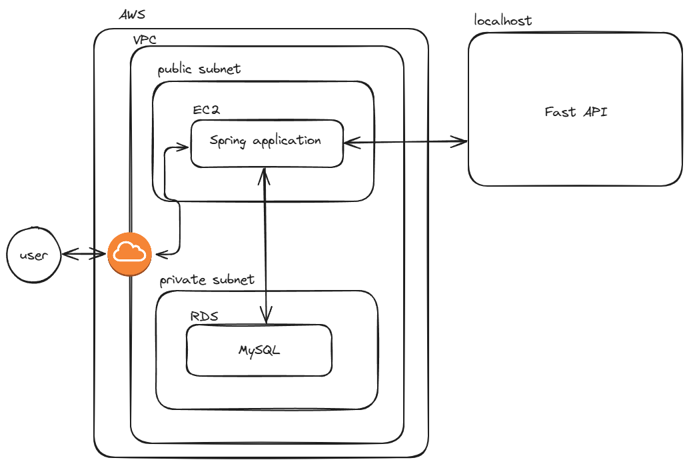

# 링링링
## 콜포비아 극복서비스

> 기획 동기

'콜포비아' 전화 통화를 할 때 두려움과 불안감을 느끼는 증상을 맣한다. 
이러한 콜포비아를 극복하기위해서 간단한 식당 예약, 배달 주문, 상품 문의를 AI와 이야기하면 콜포비아 극복을 목표로하는 AI 상담 서비스이다. 

> 사용 기술

* Spring Boot
* spring JPA
* Spring Security
* MySQL
* Fast API
* KoGPT2
* EC2
* RDS
> 담당

* 웹 아키텍처 구상 
* 회원 가입, 로그인, Spring 서버와 Fast API서버간의 통신 
* Swagger문서 제공 
* AWS 배포 

> 시스템 아키텍처

>  구현 기능

* 회원 가입
    1. 입력한 메일로 인증 코드를 전솧하고 코드를 DB에 저장
    2. 메일의 코드를 메일과 같이 전송 DB에서 확인 
    3. 회원가입 요청시 메일인증 완료된 사용자만 가입가능
* 로그인
    1. 메일과 비번을 사용한 인증을 수행하고 정상적인 사용자일 경우 id, name. email, roles정보가 있는 JWT토큰 발행 후 헤더에 추가하여 응답
* Spring 서버와 Fast API서버간의 통신
    1. 사용자가 하고자하는 통화 종류의 엔드포인프에 요청시 해당 모델의 Fast API 리소스와 통신
* 인가
    1. 토큰을 사용하여 사용자가 접근하려는 리소스에 권한이 있는지 확인
    2. 권한이 있어도 자신의 토큰을 사용하여 타인의 정보를 CRUD를 막기위해 메서드계층에서 보호

> 개선 사항

Redis를 사용한 캐싱으로 인증 인가 개선 
ELB를 사용한 트래픽 분산 

> 시연 연상

